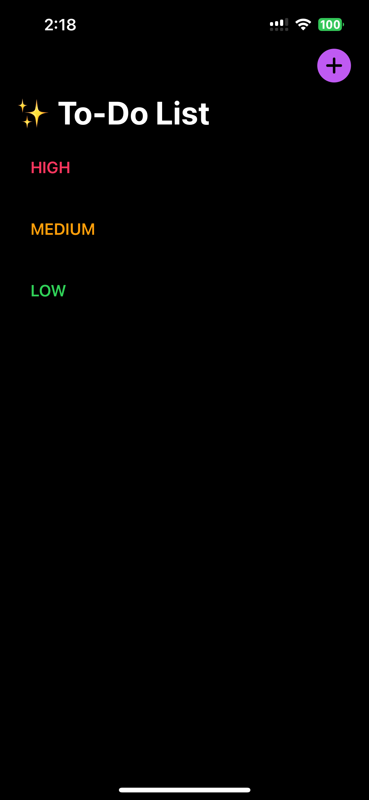
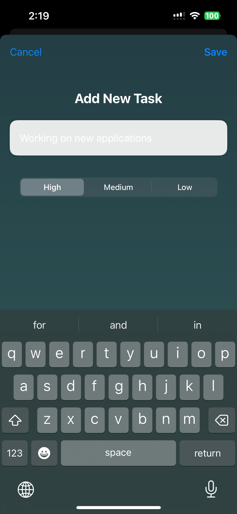
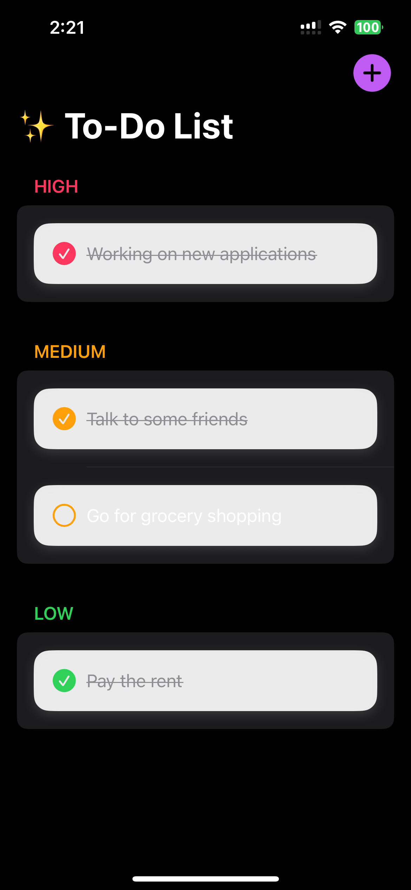

# ✅ ToDoList iOS App

A beautifully designed, simple yet powerful **To-Do List app** built with **SwiftUI** for iOS.  
Stay organized, boost productivity, and manage tasks with ease — all in a calm, modern UI ✨.

---

## 🌟 Features

- 📌 **Priority levels**: High 🔴, Medium 🟠, Low 🟢  
- 🎨 **Modern calming UI** with gradients & glassmorphism design  
- 📱 **Responsive layout** (works on iPhone & iPad)  
- 📝 **Add, delete, and mark tasks as complete**  
- 💾 **Persistent storage** (your tasks are saved locally)  
- 🌈 **Custom backgrounds & smooth animations**

---

## 📸 Screenshots

| Home Screen | Add Task | Completed Task |
|-------------|----------|----------------|
|  |  |  |


---

## 🛠️ Tech Stack

- **Language**: Swift 5.9  
- **Framework**: SwiftUI  
- **Persistence**: Local file storage with `Codable`  
- **IDE**: Xcode 15+  

---

## 🚀 Getting Started

### Prerequisites
- macOS with **Xcode 15+**
- iOS 17+ device or simulator

### Installation
1. Clone the repo:
   ```bash
   git clone git@github.com:Kyrill-7/ToDoList-iOS-APP.git
   ```
2. Open in Xcode:
   ```bash
   cd ToDoList-iOS-APP
   open ToDoList.xcodeproj
   ```
3. Build & run (`⌘R`) on Simulator or your iPhone.

---

## 🧭 Roadmap

- [ ] iCloud sync ☁️  
- [ ] Dark mode 🌙  
- [ ] Notifications & reminders 🔔  
- [ ] Custom categories & tags 🏷️  

---

## 🤝 Contributing

Contributions are welcome!  
Fork the repo and submit a pull request with your improvements.  

---

## 📜 License

This project is licensed under the **MIT License** — free to use and modify.  

---

## 👨‍💻 Author

Built with ❤️ by [**Kyrill-7**](https://github.com/Kyrill-7)  
